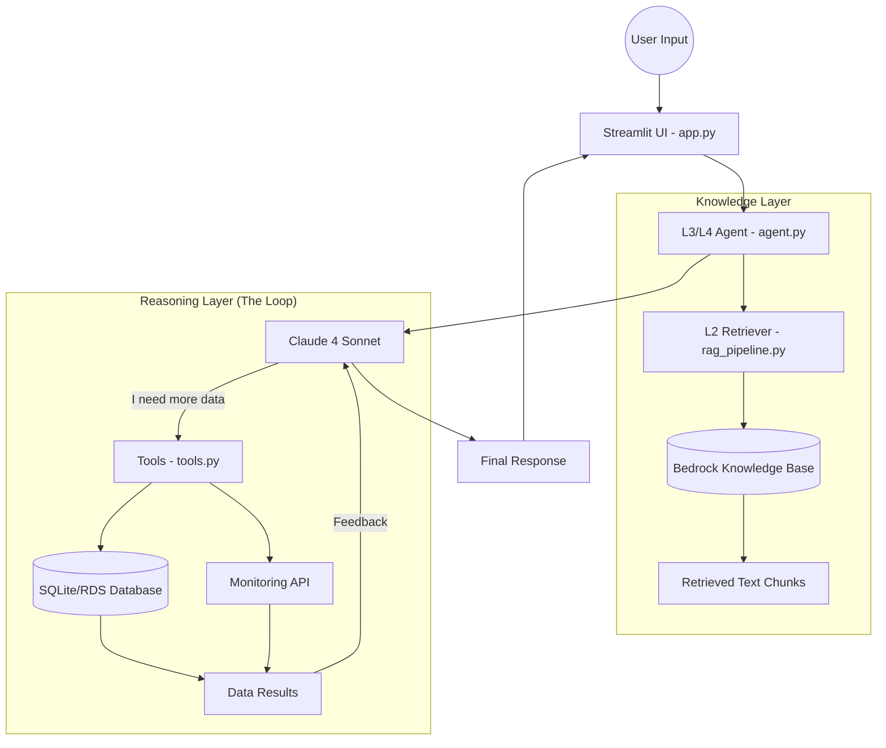

# 🏛️ GeekBrain AI: System Architecture (L1 - L4)

Tài liệu này giải thích cấu trúc mã nguồn, các lớp logic (L1-L4) và luồng xử lý dữ liệu của hệ thống RAG Agentic.

---

## 📂 1. Bản đồ các Layer (File Mapping)

Hệ thống được thiết kế theo kiến trúc phân lớp để đáp ứng từ tìm kiếm đơn giản đến điều tra phức tạp.

### **Level 1: Semantic Search (Tìm kiếm ngữ nghĩa)**
*   **File chính:** `src/knowledge_base.py` & `src/rag_pipeline.py` (Class `L1Retriever`)
*   **Chức năng:** Tải tài liệu, chia nhỏ văn bản (chunking) và thực hiện tìm kiếm bằng Vector Search trên AWS Bedrock Knowledge Base.

### **Level 2: RAG & Conflict Resolution (Tổng hợp & Giải quyết mâu thuẫn)**
*   **File chính:** `src/rag_pipeline.py` (Class `L2Retriever`)
*   **Chức năng:** Truy xuất nhiều file cùng lúc (tăng Top-K). AI sẽ so sánh các phiên bản tài liệu (v1 vs v2) để chọn ra thông tin mới nhất và chính xác nhất.

### **Level 3: Tool-Augmented RAG (Mở rộng bằng công cụ)**
*   **File chính:** `src/tools.py` & `src/agent.py` (Class `L3Agent`)
*   **Chức năng:** Định nghĩa các công cụ kết nối với Database (SQLite/RDS) và Monitoring API. AI có khả năng tự gọi các hàm Python để lấy số liệu "Live" (chi phí, metrics, incidents).

### **Level 4: Multi-turn Investigation & Memory (Điều tra đa bước & Bộ nhớ)**
*   **File chính:** `src/agent.py`
*   **Chức năng:** Duy trì bộ nhớ hội thoại (`ConversationMemory`). AI có khả năng thực hiện vòng lặp suy luận (Reasoning Loop): Nếu bước 1 lấy dữ liệu chưa đủ, nó sẽ tiếp tục bước 2, bước 3 cho đến khi giải quyết được vấn đề.

---

## 🔄 2. Luồng hoạt động (Workflow)

Khi bạn gửi một câu hỏi (ví dụ: *"NotificationSvc có ổn không?"*), hệ thống sẽ chạy qua 5 bước sau:

### **Bước 1: Tiếp nhận & Truy xuất ban đầu (Retrieval)**
*   Hệ thống gọi `L2Retriever` để quét Bedrock Knowledge Base.
*   **Kết quả:** Trả về các **Chunks** (Đoạn văn bản trích dẫn) từ các file như `service_notificationsvc.md`, `team_engagement.md`.

### **Bước 2: Lập kế hoạch suy luận (Planning)**
*   AI (Claude 4 Sonnet) nhận các Chunks này cùng với danh sách **Tools**.
*   AI nhận định: *"Trong file ghi dịch vụ này hay lỗi, tôi cần kiểm tra Status và Metrics thực tế ngay bây giờ"*.

### **Bước 3: Vòng lặp gọi Tool (The Loop)**
*   **Lượt 1:** AI yêu cầu dùng tool `get_status`. Hệ thống thực thi và trả về kết quả `degraded`.
*   **Lượt 2:** AI thấy status lỗi, nó yêu cầu dùng tiếp tool `get_metrics` để xem con số cụ thể.
*   **Lượt 3:** AI yêu cầu `get_incidents` để xem lịch sử sự cố trong Database.

### **Bước 4: Đối chiếu & Tổng hợp (Synthesis)**
*   AI cầm trên tay: 1. Đoạn văn bản từ file (Chunks), 2. Số liệu từ DB (Tools).
*   Nó thực hiện đối chiếu: *"File nói SLA là 200ms, nhưng Metrics hiện tại là 500ms -> Kết luận: Vi phạm SLA"*.

### **Bước 5: Trả lời & Cập nhật UI**
*   AI trả về câu trả lời cuối cùng.
*   **Dashboard (app.py)** hiển thị: Câu trả lời, Danh sách file đã đọc (Sources), và các bước suy luận (Reasoning logs).

---

## 🛠️ 3. Sơ đồ kỹ thuật (Technical Diagram)

---

## 💡 4. Các tính năng "Ăn điểm" (Bonus Features)

1.  **Observability (Bonus A):** Toàn bộ quá trình suy luận ở Bước 3 được log ra panel bên phải màn hình.
2.  **Reasoning (Bonus B):** Khả năng tự xoay xở khi Tool lỗi hoặc tài liệu mâu thuẫn.
3.  **Auto-Sync (Bonus C):** Tính năng Upload file trên UI tự động đẩy lên S3 và Trigger Bedrock Ingestion.
